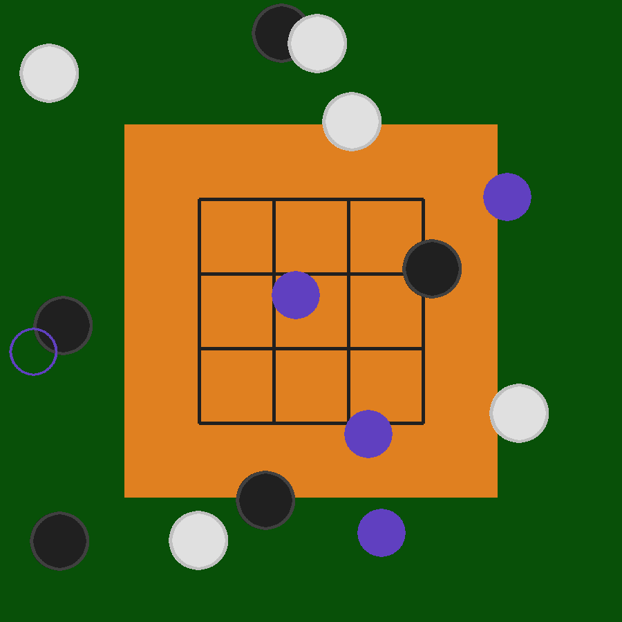

# Omega Zero: learning to play in a virtual environment

Omega Zero, Oz for short, is an exploration of the learning of commonsense knowledge in a virtual 2D environment mimicking the physical setup for the game of Go. The goal is to learn enough commonsense knowledge to enable learning from demonstration of new games that can be played in this domain.

We call our exploration "Omega Zero" because the goal here is not acing the game as in AlphaGo, thus "Omega", but learning to play it without being given either prior knowledge of the game rules or prior data abstractions representing the game, thus "Zero". Our intuition is that learning to play in an adequately physical environment is qualitatively different from and significantly harder than learning to win.

 
*Oz in a Tic-Tac-Toe setup*

##  Challenge: learn commonsense for learning to play

We use a 2D digital version of the Go board and Go stones as an experimental setup where an AI agent can play at least three common games:

1. Go
2. Gomoku
3. Tic-Tac-Toe

and many other new games we could invent.

It is trivial to code up each of these games so that an AI agent can "play" it by generating a good next move given any game state and leading to a eventual "win". AlphaGo did that brilliantly. But that is not what Oz is about.

Instead, the challenge is for an AI agent to learn from demonstration how to play at least one of these three games (e.g. Go) when given only knowledge about how to play the other one or two games.

Ideally, an AI agent will be given no game-specific knowledge at all but will be given only generic or commonsense knowledge about the environment on the basis of which it is expected to learn all three games through learning from demonstration.

Idealistically, an Oz AI agent will not be given any prior knowledge at all and will have to learn the knowledge needed. This is indeed a bit idealistic, but yep that's we are aiming at and the gut feeling is that we are getting close to be able to pull that off.

##  Environment: an interactive flatland under the bird's eye view

The Oz environment is a flatland with layers. One layer for the background, one layer for the board, one layer for the lines on the board, and one or more layer for the stones. Multiple stones may overlap in the same layer. Both board and stones are of their regular physical size. The environment extends beyond the board by half of the board's dimension in each of the four directions. The board may rotate against the background. The stones are of their regular colors: black and white. Individual stones may or may not vary in the specific shades and patterns of their color. Stones could be at anywhere in the environment. They could all be piled up at a single location or be scattered around completely separately.

The physics of Oz is simple: continuous 2D space, continuous time, asynchronous interaction, no gravity, no friction, no force, and no inertia.

Agents interact with the environment through their respective "cursors". There may be multiple cursors, each of which is controlled by a single agent, which could be a human interacting with the Oz envrionment through GUI. The cursors may or may not be visually differentiated. Cursors move by relative motion. Cursor motion commands are speed vectors. The speed vector must be issued continuously at every time step for the cursor to move continuously. There is kinesthetic feedback as well as visual feedback for cursor movements. Cursors can move across each other without any interference.

When a cursor is clicked over a stone, the stone is picked up. When the cursor moves, the stone moves along. When the cursor is clicked again the stone is dropped. Only one stone will be picked up or held at a time. When a stone is being picked up or held, one kind of tactile feedback is provided. When the board is touched, another kind of tactile feedback is provided. When the background is touched, yet another kind is provided. The point of touch is a single point. When multiple stones are at the point of touch, only one stone is picked up. When multiple cursors attempt to pick up the same stone simultaneously, the result (i.e. which cursor actually picks up the stone) is random. One cursor can also "grab" a stone held by another cursor by clicking on it.

At any point in time, the whole environment, including the board, the stones, and the cursor could be rendered into an image, from the bird's eye view. However, the optical axis of the bird's eye may or may not be perpendicular to the board. The image is given to the AI agent as its visual input along with the tactile and kinesthetic feedback.

The image could also be presented through a GUI to one or more human agents, allowing the humans to interact with the Oz environment through the GUI. Cursor states such as it is being pressed down and held will also be rendered per normal GUI practice. Tactile feedback could also be visualized for human interaction, but may be unnecessary. Kinesthetic feedback is not provided to human agents because they can get that for their hand movement.

Three things can be noted about this setup:

1. Except for the fact that the physics of the Oz environment is totally unrealistic, the way in which our AI agents interact with the Oz environment is highly similar to how humans play board games through GUI on a normal computer.
2. The Oz setup allows multiple AI agents and multiple humans to simultaneously interact with the environment, giving us ample opportunity to do teaching or demonstration by either AI or human teachers.
3. The physical setup of Oz, including the vision or image rendering part, is not unlike the relationship between a SCARA robot and its task environment. Thus, our solutions could almost directly enable the many SCARA robots out there to adapt to new tasks very quickly.

## Illustration: exploration of affordance learning

For one example of the kinds of exploration Oz enables, please see this other separate set of notes on [learning affordances](affordances.md) as commonsense knowledge. Note that the affordance perspective is only one of the potentially many theoretical perspectives we can take on the [Oz envirnoment](#environment) and the [Oz challenge](#challenge).

# Delta One: learning to play in the real world

We take Omega Zero to be a stepping stone towards Delta One, wherein a robot learns from human demonstrations to play Go, Chess, and Chinese Chess bodily with real game sets and without calibration, special adaptation, or special hardward. "Delta" marks the leap from digital to physical and "One" emphasizes the requirement that a single version of a single system is used without retraining or any other offline tweaking, just like how one person can in a very short period of time learn to play Go, Chess, and Chinese Chess.
